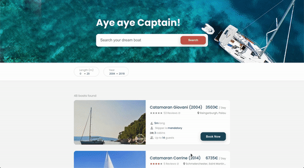

# Boat Search



Boat search is a single page react application where you can search boats. Server state is fetched from a GraphQL API and the UI state (filters and pagination) is handled by URL queries to keep the application simple.

## See in action

https://boat-search-react.vercel.app

## How to run

Inside the application folder, install `node_modules` and run the dev server:

```
yarn && yarn start
```

## Design

The application is designed by me and Figma was the tool of choice.

## Technologies

- React (Hooks)
- React Router
- Apollo GraphQL Client
- Styled Components

## Folder Structure

I tried to keep the folder structures as simple as possible. Main folder here is `components` which is divided into smaller folders by feature. All components have their own file and they are exported from `index.js` to keep imports clean. Styled components are kept under a single file called `styles.js`

```
.
├── __tests__
│   ├── Filter.test.js
│   └── ...
├── components
│   ├── boat
│   │   ├── Boat.js
│   │   ├── index.js
│   │   └── styles.js
│   └── ...
├── grapql
│   └── boats.js
├── hooks
│   ├── filter.js
│   └── urlQuery.js
├── App.js
├── index.js
└── index.css
```
